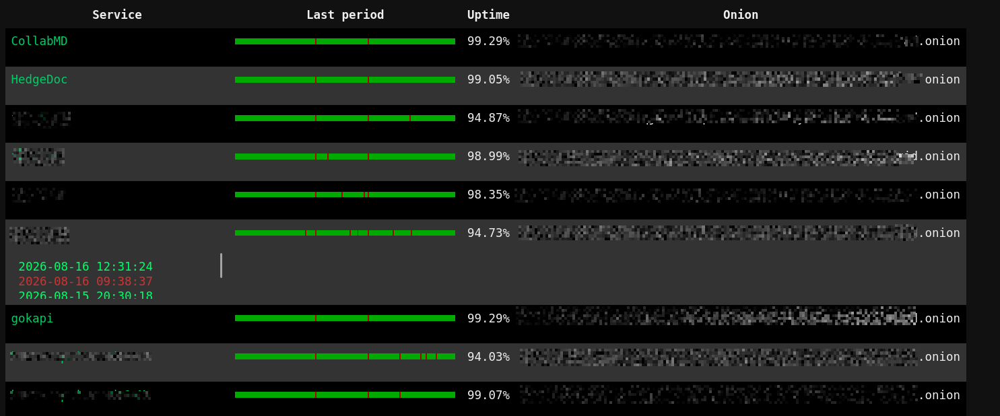

# OnionWatcher

A lightweight uptime monitor for Tor onion services.



OnionWatcher continuously monitors configured `.onion` services, records availability history, automatically rotates Tor circuits after failures, and provides a web dashboard for uptime visualization.

It is designed for operators running services accessible through Tor, such as:

- Bitcoin nodes
- Lightning nodes
- Web services
- IRC/XMPP servers
- Other hidden services

OnionWatcher is independent software and is not affiliated with or endorsed by the Tor Project.


## Features

- Continuous monitoring of onion services
- HTTP and TCP checks
- Tor SOCKS5 routing
- Tor ControlPort integration
- Automatic NEWNYM circuit rotation after failures
- Failure confirmation before marking services offline
- Retry queue for failed services
- SQLite persistence
- Event history
- Configurable monitoring interval
- Randomized probe jitter
- Web dashboard
- Configurable uptime calculation window


# Requirements

- Python 3.9+
- Tor running locally
- Tor SOCKS proxy enabled
- Tor ControlPort enabled

Python dependencies:
- PyYAML
- requests[socks]
- PySocks
- Flask
- stem

Install:
```bash
pip install -r requirements.txt
```

Tor configuration

OnionWatcher requires these in `/etc/tor/torrc`:
```
SocksPort 9050
ControlPort 9051
CookieAuthentication 1
CookieAuthFileGroupReadable 1
```
Restart Tor:
```
sudo systemctl restart tor
```

The user running OnionWatcher must be able to access the Tor control cookie.

Example:
```
sudo usermod -aG debian-tor onionwatcher
```
Log out and back in after changing groups, or issue `newgrp debian-tor`.

Test:
```
python3 -c "
from stem.control import Controller
with Controller.from_port(port=9051) as c:
    c.authenticate()
    print('Tor control OK')
"
```

## Configuration

Copy:
config.example.yaml
to:
config.yaml

Example:
```
database: onionwatcher.db
services_directory: services
tor_proxy: socks5h://127.0.0.1:9050
web_port: 3040
probe_interval: 30
jitter_seconds: 5
failures_before_offline: 3
uptime_days: 7
```

Services

Services are defined as YAML files inside the services directory.

Example:

services/example.yaml
```
services:
  - name: Example Bitcoin node
    address: examplexxxxxxxx.onion
    port: 8333
    type: tcp

  - name: Example website
    address: examplexxxxxxxx.onion
    port: 80
    type: http
    path: /

  - name: Example monero node
    address: examplexxxxxxxx.onion
    port: 18081
    type: monerod
```

Supported types:
```
http     HTTP request check
tcp	     TCP connection check
monerod  monerod node witb open RPC
```
### Running OnionWatcher

Start the monitor:
```
python3 onionwatcher.py
```

Example output:
```
[2026-08-17 12:00:01] Loaded 4 services

[2026-08-17 12:00:31]
Checking Bitcoin node
(example.onion:8333)

Result: FAILED

Requested new Tor circuit

New Tor circuit:
relay1 -> relay2 -> relay3

Added retry (1/3)
```

Running the dashboard (only meant for local use)

Start:
```
python3 visualizer.py
```

Open:

http://localhost:3040

The dashboard displays:

- service name
- onion address
- uptime percentage
- uptime timeline
- online/offline event history

### Failure handling

On a failed check:
```
Service check fails
        |
        v
Increase failure counter
        |
        v
Request new Tor circuit
        |
        v
Queue retry
        |
        v
Successful retry?
        |
       yes
        |
        v
Continue monitoring


       no
        |
        v
Reach failure threshold
        |
        v
Mark service offline
```

This avoids treating transient Tor routing failures as service outages.

### SQLite stores:

#### services

Configured monitored services.

#### service_state

Current status:
- online
- offline
- unknown

and failure counters.

#### events

State transitions

Example:
unknown -> online
online -> offline
offline -> online
